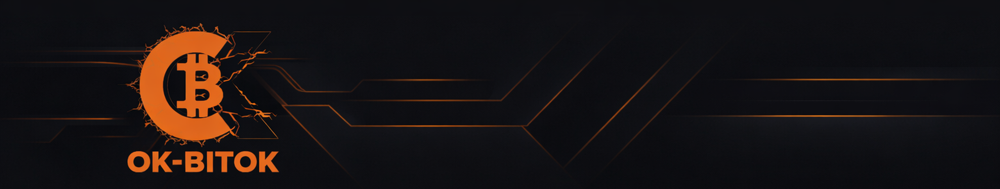
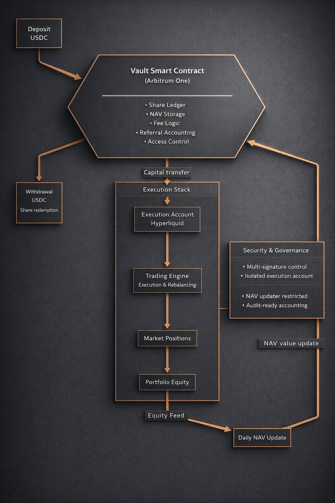

  

---

<table>
<tr>
<td width="160">

</td>
<td>

# OK-BITOK Vault

**On-Chain Structured Delta-Neutral Infrastructure**

OK-BITOK Vault is a structured DeFi protocol designed to capture funding and basis inefficiencies while maintaining controlled directional exposure.

The protocol combines deterministic on-chain share accounting with a dedicated execution infrastructure, enabling transparent capital allocation and disciplined liquidity management.

</td>
</tr>
</table>

---

## Protocol Summary

| Component | Responsibility |
|------------|----------------|
| Smart Contract | Share ledger, NAV storage, fee logic, referral accounting |
| Execution Stack | Market deployment, rebalancing, liquidity provisioning |
| NAV Updater | Controlled equity synchronization |
| Manager | Capital operations and settlement coordination |

TVL is derived from share supply × NAV.  
The smart contract functions as a capital accounting layer, not a trading engine.

---

## Architecture

  

The system is intentionally divided into:

- On-chain deterministic accounting
- Off-chain execution infrastructure
- Controlled NAV propagation
- Structured fee crystallization

This separation preserves accounting integrity while enabling institutional-grade execution flexibility.

---

## Strategy Class

The vault operates within the following strategic framework:

- Delta-neutral positioning  
- Funding rate capture  
- Basis convergence strategies  
- Controlled leverage exposure  
- Liquidity-aware position sizing  

The system is designed to perform in both expansionary and contractionary market regimes.

---

## Capital Lifecycle

1. Investor deposits USDC.
2. Shares are minted at current NAV.
3. Capital is deployed through execution infrastructure.
4. NAV reflects realized equity.
5. Withdrawals are settled via share redemption.

All investor ownership is represented through shares.  
Profit crystallization occurs through deterministic share redistribution.

---

## Fee Model

- Performance-based
- Crystallized in shares
- Deterministic and non-inflationary
- VIP tier adjustments supported
- Referral rewards integrated into accounting layer

No hidden dilution mechanics.

---

## Security & Accounting Model

- Reentrancy protection
- Deterministic rounding safeguards
- Share supply invariants
- Registry-based batch processing
- Controlled role separation

The smart contract guarantees accounting correctness.  
Operational liquidity management is handled under defined procedures.

---

## Transparency

- Contract deployed on Arbitrum
- Public NAV accounting
- On-chain share ledger
- Explicit trust model

Smart Contract:  
https://arbiscan.io/address/0xD772A28caf98cCF3c774c704cA9514A4914b50A0

---

## Documentation

- Protocol Specification: `PROTOCOL_SPEC.md`
- Docs Portal: https://docs.ok-bitok.com
- Website: https://ok-bitok.com

---

## Contact

contact@ok-bitok.com
